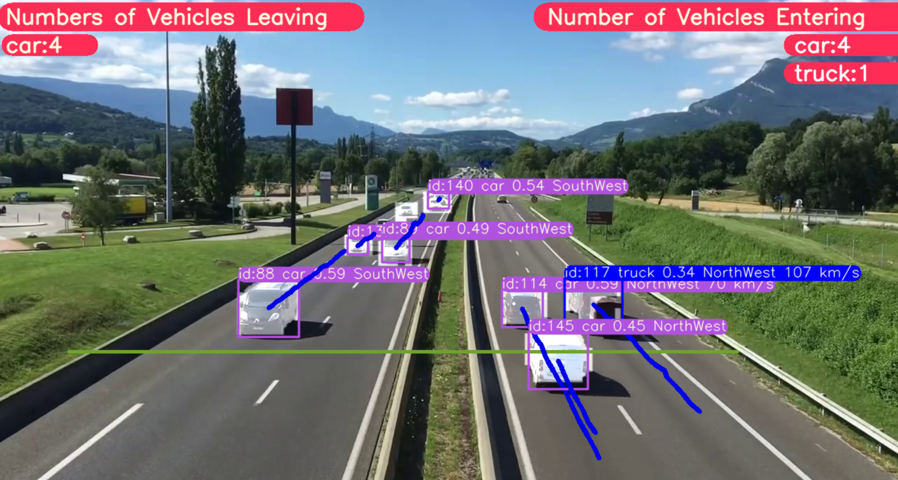

# 🎯 Vehicle Segmentation, Tracking, Counting, and Speed Estimation using YOLOv11

## 📋 Project Overview

This project implements a **complete vehicle analysis pipeline** from video input:
- **Vehicle segmentation** using YOLOv11
- **Multi-object tracking** to follow each vehicle across frames
- **Counting vehicles** entering and leaving the scene
- **Speed estimation** for moving vehicles

The system works with input videos and generates output videos showing **bounding boxes, vehicle IDs, direction, count, and estimated speed.**



## 📊 Input / Output

- Input videos are stored in ressources/videos/
- Output videos are stored in output/
- The system is designed for real-world traffic videos, e.g., intersections, roads, or parking lots.

## ✨ Key Features
- Real-time **vehicle segmentation and tracking**
- **Counting vehicles** entering and leaving a scene
- **Speed estimation** displayed per vehicle
- **Visual outputs** showing segmentation, vehicle IDs, direction arrows, counts, and speed

## 🛠️ Tech Stack

- **Programming Language:** Python 3.11
- **Libraries & Tools:**
   - Ultralytics YOLOv11 (segmentation & detection)
   - OpenCV (video processing & visualization)
   - Numpy (calculations)
   - Multithreading for efficient video processing

## 📁 Repository Structure

```
vehicle-tracking-speed-estimation-yolov11/
│
├── multithreaded_tracking.py      # Main Python script
├── scripts/
├── ressources/
│   └── videos/                    # Input videos
├── output/                        # Output videos with results
├── requirements.txt               # Python dependencies
└── README.md

```

## 🏁 Getting Started

Follow these steps to set up and run the project:
1. **Open Anaconda Prompt** (or your terminal of choice).
2. **Clone the repository** :
```
git clone https://github.com/eyazaoui123/vehicle-tracking-speed-estimation-yolo.git
cd vehicle-tracking-speed-estimation-yolo
cd vehicle-tracking-speed-estimation-yolo
```
3. **Create a new Python environment** (recommended Python 3.11):
```
conda create -n vehicle_tracking python=3.11 -y
conda activate vehicle_tracking
```
4. **Install dependencies:**
```
pip install -r requirements.txt
```
5. **Run the project:**
```
python multithreaded_tracking.py
```
- Input videos should be placed in ressources/videos/
- Processed videos will be saved in output/

  
## 🌐 Applications

- Smart traffic monitoring and analysis
- Real-time vehicle counting for tolls, parking lots, and intersections
- Vehicle speed estimation for road safety and research

## 🔮 Future Improvements

- Add automatic detection of lane changes and traffic violations
- Real-time alerts for traffic congestion or overspeeding vehicles
- Integrate with edge devices for live monitoring

## 👩‍💻 Author

**Eya Zaoui**
- 💼 AI & Software Engineer | | Expert in Machine Learning, Deep Learning, and Computer Vision
- 📧 Email: zaouieya2@gmail.com
- 🔗 LinkedIn: [linkedin.com/in/eya-zaoui](linkedin.com/in/eya-zaoui)
